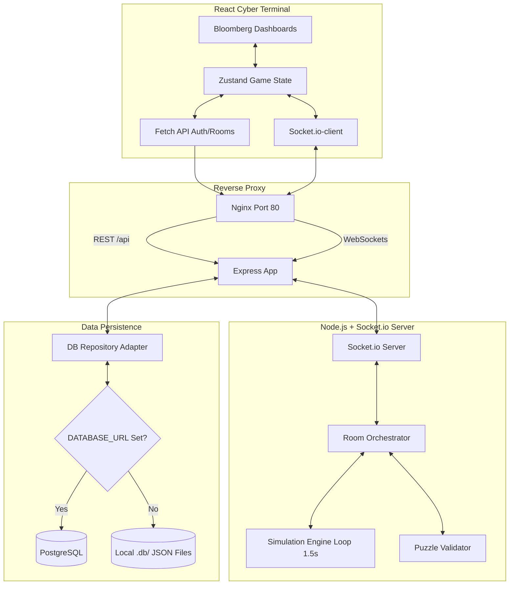

# ☣️ Liquidity Crisis Escape Room

An interactive, high-fidelity, real-time multiplayer financial crisis simulation designed as a cooperative escape room. Players must work together as specialized bank departments to survive five escalating systemic market shocks, manage extreme liquidity crunches, meet margin requirements under fire-sale hair-cuts, and prevent their institution from going insolvent before the regulatory countdown timer hits zero.

The project features a **modern fintech cyberpunk CRT terminal aesthetic** that blends a Bloomberg Terminal dashboard with intense cooperative puzzle-solving mechanics (similar to *Keep Talking and Nobody Explodes*).

---

## 🚀 Key Features

* **Real-Time Financial Simulator**: A sub-second simulation engine ticking down solvency timers, adjusting Value at Risk (VaR), expanding bid-ask spreads, sliding panic index scales, and degrading Regulatory Liquidity Coverage Ratios (LCR) dynamically.
* **4 Specialized Co-op Roles**:
  * **Trader**: Executes rapid portfolio liquidations across market venues and protects lines with Credit Default Swaps (CDS).
  * **Treasury Manager**: Orchestrates cash allocations, tracks HQLA balances, and draws emergency central bank loans.
  * **Risk Manager**: Monitors portfolio VaR thresholds, executes interest rate hedging swaps, and sets counterparty credit limits.
  * **Analyst**: Decrypts numerical coordinates, requests regulatory solver hints, and models upcoming crisis shocks.
* **5 Escape Room Crisis Scenarios**:
  * **Bank Run**: Rapid depositor cash depletion $\rightarrow$ Solve by balancing cash outflow pipes.
  * **Margin Call**: 30% crash in bond collaterals $\rightarrow$ Solve by posting optimal, cheapest-to-deliver asset ratios under haircuts.
  * **Market Freeze**: 500bps bid-ask spreads $\rightarrow$ Solve by distributing trades across Lit, Dark, and OTC pools to minimize transaction slippage.
  * **Counterparty Failure**: Systemic defaults domino chain $\rightarrow$ Solve by isolating toxic graph nodes and executing protection CDS.
  * **Systemic Financial Crash**: Multi-market credit freeze $\rightarrow$ Solve by drawing custom Federal repo loans under stigma interest budgets.
* **Bloomberg-style Neon Dashboard**: Real-time Recharts indicators graphing solvency, asset values, and warning sirens, plus role chat coordination boxes and administrative shock injection controllers.
* **Zero-Dependency Fallback Adapter**: Auto-detects if PostgreSQL is unavailable and automatically hot-swaps to a secure localized JSON-file database, enabling flawless out-of-the-box local testing.

---

## 🛠️ Technology Stack

* **Frontend**: React, TypeScript, Vite, TailwindCSS, Zustand (unified client states), Framer Motion (visual glitch alerts and screen boots), Recharts (tick line charts), Lucide React (vector terminal icons), Web Audio API (synthesized alarm sirens and click tones).
* **Backend**: Node.js, Express, TypeScript, Socket.io (sub-100ms bi-directional event packet syncing).
* **Databases**: PostgreSQL (Production) / Transactional JSON File DB (Local Fallback).
* **Infrastructure**: Docker, Docker Compose, Nginx (Unified entrypoint proxy & static server).

---

## 📐 System Architecture Diagram



---

## 🗄️ Database Tables Schema

The database persistence layers are built on the following schemas:

* **`users`**: Manages credentials, password hashes (bcrypt), and cumulative player XP levels.
* **`game_sessions`**: Tracks room codes, active scenario phases, ratios (LCR, NSFR, Panic), and remaining times.
* **`players`**: Manages session participants, roles locks, and readiness switches.
* **`puzzles`**: Stores state, generation limits, and attempt rates of scenario puzzles.
* **`market_state`**: Stores tick sequences for graphing historical lines.
* **`crisis_events`**: Stores dynamic crisis logs and admin shocks triggered in rooms.
* **`leaderboards`**: Holds high scores list, completion durations, and preserved cash reserves.
* **`audit_logs`**: Records detailed system audit feeds for post-game inspection.

---

## 🔌 API & Event Matrix Contracts

### REST API Endpoints (`/api/v1`)
* `POST /auth/signup`: Registers a new operator.
* `POST /auth/login`: Authenticates an operator, returning a JWT.
* `GET /auth/me`: Validates clearance token and returns profile data.
* `POST /rooms/create`: Provisions a new room with a random 6-character code.
* `POST /rooms/join`: Validates invite code and logs player into lobby state.
* `GET /leaderboard`: Pulls top stabilizing teams scores.
* `POST /admin/trigger-shock`: Manual shock injection (Rate Hike, Sovereign Downgrade, Cash Squeeze).
* `GET /rooms/:roomCode/logs`: Fetches the history of audits and chart logs.

### WebSockets (Socket.io) Event Matrix
* **Client-to-Server Events**:
  * `join_room`: Registers socket identifiers to a game room session.
  * `select_role`: Dynamic cooperative role reservation (Trader, Treasury, Risk, Analyst).
  * `toggle_ready`: Logs readiness (blocks start unless all players are locked in).
  * `start_game`: Initiates the 1.5s simulation loop.
  * `trader_action`: Execute asset sale (Liquidate Gov/Corp bonds).
  * `treasury_action`: Draw emergency CB discount window funding.
  * `risk_action`: Trigger portfolio currency swap hedging programs.
  * `submit_puzzle_solution`: Server-side solution validation.
  * `request_analyst_hint`: Requests math decryption clues.
  * `send_chat`: Relays message to room members.
* **Server-to-Client Events**:
  * `room_state_updated`: Broadcasts lobby players, roles, and ready indicators.
  * `game_started`: Triggers UI layout change to cockpit, boots up charts.
  * `market_tick`: High-frequency metrics updates (LCR, NSFR, Spreads, Panic, Portfolios).
  * `puzzle_solved_alert`: Visual chime notify indicating successful phase resolution.
  * `puzzle_failed_alert`: Visual error and penalty notice.
  * `analyst_hint_data`: Unlocks encrypted coordinates on the Analyst console.
  * `scenario_advanced`: Shifts grid styles, unlocks next scenario puzzle.
  * `chat_message_received`: Appends message to chat logger.
  * `game_over`: Halts simulation and loads the quantitative score report.

---

## 🛠️ Step-by-Step Installation Guide

Ensure you have [Node.js (v18+)](https://nodejs.org/) installed. Git and Docker are optional.

### Option 1: Standard Zero-Dependency Local Setup (Recommended)
This method runs the application immediately using the lightweight JSON-file database fallback. No database configuration or server installation is required.

1. **Clone the project & Navigate to directory**:
   ```bash
   cd "project two"
   ```

2. **Setup and Boot Backend**:
   ```bash
   cd backend
   npm install
   npm run dev
   ```
   *The server is now running on `http://localhost:3001` using the auto-switched JSON database.*

3. **Setup and Boot Frontend**:
   Open a new terminal window:
   ```bash
   cd "project two/frontend"
   npm install
   npm run dev
   ```
   *Vite development server starts on `http://localhost:5173`. Proxies are configured to forward queries to port 3001 automatically.*

4. **Access the terminal**:
   Open your browser and navigate to `http://localhost:5173`.

---

### Option 2: Production Multi-Container Docker Deployment
This spins up the entire production configuration, including isolated Nginx server routing, Node backend, PostgreSQL persistence, and Redis caches in a single command.

1. **Launch Containers**:
   In the project root directory containing `docker-compose.yml`:
   ```bash
   docker-compose up --build
   ```

2. **Access the Application**:
   Open your browser and navigate to `http://localhost`. Nginx listens on port 80 and manages all proxy routes automatically.

---

## 🎮 Game Rules & Operations Guide

1. **Cooperation is Key**: Restricted viewports enforce cooperative communication. For example, in Scenario 2 (Margin Call), the Trader must submit the asset allocation, but the Haircut percentages are only visible to the Risk Manager, and the Optimizer formula is only visible to the Analyst. Players must read their parameters out loud to compute solutions.
2. **Terminal Hot-Swapping**: If you are playing solo or in a small team, use the **Operator Terminals** tab selection inside the center panel to hot-swap between Trader, Treasury, Risk, and Analyst sub-screens.
3. **Be Fast**: If you submit an incorrect puzzle calculation, regulators will apply a severe **-25 second time penalty** and increase the **panic index by 12%**!
4. **Panic Impact**: As the Panic Index rises, bid-ask spreads widen and asset liquidation yields crash! Sell assets early, or solve puzzles quickly to restore calm.
5. **Fed Drawdowns**: Drawing from the Fed Discount Window provides instant Cash (boosting LCR), but triggers a severe **Central Bank Stigma Panic Penalty (+8%)**. Balance its usage carefully!
