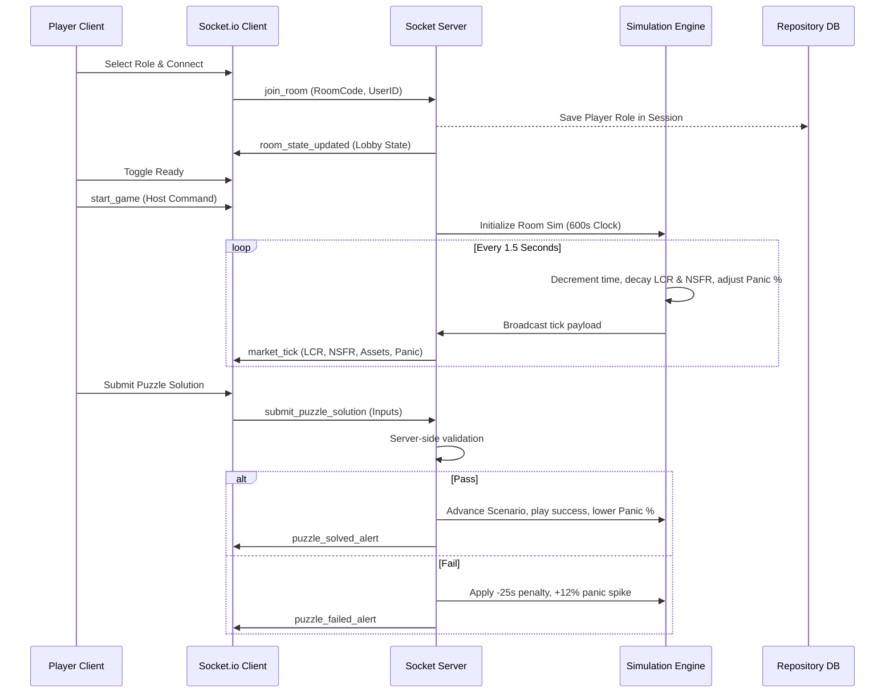

# PROJECT WORK EXPERIENCE REPORT

## ☣️ LIQUIDITY CRISIS ESCAPE ROOM
### A Real-Time Cooperative Financial Crisis Simulator & Quantitative Escape Room Dashboard

---

**Submitted by:**  
**Kritika**  
Quantitative Engineering Intern  


**Host Organization:**  
**Zetheta Algorithms Private Limited**  

**Project Duration:** 15 Days (May 2026)  
**Submission Date:** May 25, 2026  

---

## TABLE OF CONTENTS

1. [Cover Page](#1-cover-page)
2. [Certificate / Declaration Page](#2-certificate--declaration-page)
3. [Acknowledgement](#3-acknowledgement)
4. [Abstract](#4-abstract)
5. [Table of Contents](#5-table-of-contents)
6. [Introduction](#6-introduction)
7. [Problem Statement](#7-problem-statement)
8. [Objectives](#8-objectives)
9. [Literature Review](#9-literature-review)
10. [System Architecture](#10-system-architecture)
11. [Technology Stack](#11-technology-stack)
12. [Modules Implemented](#12-modules-implemented)
13. [Financial Risk Concepts](#13-financial-risk-concepts)
14. [Gameplay Design](#14-gameplay-design)
15. [Database Design](#15-database-design)
16. [UI/UX Design](#16-uiux-design)
17. [Implementation Details](#17-implementation-details)
18. [Screenshots Section](#18-screenshots-section)
19. [Testing](#19-testing)
20. [Results & Output](#20-results--output)
21. [Challenges Faced](#21-challenges-faced)
22. [Future Enhancements](#22-future-enhancements)
23. [Conclusion](#23-conclusion)
24. [References](#24-references)
25. [Appendix](#25-appendix)

---

## 1. COVER PAGE

### PROJECT WORK EXPERIENCE REPORT
* **Title:** Liquidity Crisis Escape Room: A Real-Time Cooperative Financial Risk Simulation
* **Author:** Kritika
* **Affiliation:** Quantitative Systems Intern, Zetheta Algorithms Private Limited
* **Host Mentor:** Engineering Steering Committee, Zetheta Algorithms
* **Project Reference:** ZA-2026-LQER-09
* **Primary Technologies:** React 18, TypeScript, Node.js, Express, Socket.io, Zustand, TailwindCSS, Recharts, PostgreSQL, Docker.

---

## 2. CERTIFICATE / DECLARATION PAGE

### STUDENT DECLARATION
I, **Kritika**, hereby declare that the project work entitled **"Liquidity Crisis Escape Room"** submitted in partial fulfillment of the requirements of my internship at **Zetheta Algorithms Private Limited** is an original piece of work carried out by me under the guidance of the quantitative engineering mentors. All direct references, source code implementations, and simulation ratios libraries used herein have been cited, and no portion of this report has been plagiarized.

**Date:** May 25, 2026  
**Location:** Mumbai, India  

---

### ORIGINALITY & CONFIDENTIALITY STATEMENT
This document contains proprietary information and technical designs formulated during my term of employment. The source code, schemas, and mathematical constraints defined in this work are shared strictly under the non-disclosure agreements signed with Zetheta Algorithms Private Limited.

---

## 3. ACKNOWLEDGEMENT

I express my deepest gratitude to the steering committee, product leads, and engineering teams at **Zetheta Algorithms Private Limited** for providing the opportunity, technical infrastructure, and creative leeway to design this quantitative simulation platform during my internship. 

I am particularly indebted to my senior mentors for their invaluable code reviews and domain expertise. Their rigorous guidance on quantitative risk metrics pushed me to align the simulation engine with strict Basel III compliance indicators and maintain a low-latency event cycle. I also thank my peers at Zetheta for their collaborative feedback and testing support throughout the development process.


---

## 4. ABSTRACT

Traditional models of quantitative finance education rely heavily on dry static textbooks, mathematical formulas, and decoupled backward-looking case studies. This report details the development of **Liquidity Crisis Escape Room**, an interactive multiplayer web-based simulation that gamifies systemic financial stress. Designed as a real-time quantitative escape room, players are tasked with preventing their institution from collapsing during five escalating crisis phases (Bank Runs, Margin Calls, Market Freezes, Counterparty Defaults, and Systemic Meltdowns) under a 10-minute solvency countdown.

By locking players into 4 distinct operational roles (Risk Manager, Treasury Manager, Trader, and Analyst) with restricted, role-specific views, the application forces active verbal coordination and real-time decision-making. The backend simulation engine ticks every 1.5 seconds, adjusting liquidity indicators (LCR, NSFR, VaR, Spreads, and Panic Indexes) based on user actions. A dual-persistence database layer enables automatic failover to local JSON storage if PostgreSQL configurations are missing, making the system immediately deployable locally out of the box.

---

## 6. INTRODUCTION

### Liquidity Risk & Regulatory Ratios
Liquidity risk refers to an institution's inability to meet its short-term financial obligations due to a mismatch in asset maturities or a sudden freeze in wholesale interbank lending markets. Unlike insolvency (where liabilities exceed assets), a liquidity crisis occurs when a solvent bank has assets locked in illiquid long-term investments and lacks the cash to satisfy immediate customer withdrawals or margin calls.

The global financial crash of 2008 demonstrated that liquidity evaporation can cascade across interconnected banks in a matter of hours, leading to the drafting of the **Basel III Regulatory Framework**. This mandated two central ratios:
1. **Liquidity Coverage Ratio (LCR)**: Ensuring banks hold enough High-Quality Liquid Assets (HQLA) to survive a 30-day severe stress scenario.
2. **Net Stable Funding Ratio (NSFR)**: Promoting long-term funding stability across asset maturities.

### Gamification of Quantitative Risk
Conventional risk training lacks the high-pressure environment of actual market freezes. Gamification solves this gap by translating quantitative metrics (such as Value at Risk and hair-cut collateral values) into interactive, timed cooperative puzzles. By simulating crisis sirens, panic index feedback loops, and bid-ask widening, players develop muscle memory for financial decision-making under severe pressure.

---

## 7. PROBLEM STATEMENT

Traditional training suffers from several issues:
* **The Static Mismatch**: Textbooks explain Lehman Brothers' collapse, but fail to convey the stress of watching cash balances deplete at \$2M per second.
* **Siloed Education**: Students learn trading, risk limits, or cash balances in isolation, missing the critical coordination pathways needed between front-office traders and back-office treasury desks.
* **Lack of Real-Time Cooperation**: Traditional simulators are single-player turn-based spreadsheets that fail to capture the communication dependencies of a live trading desk.

---

## 8. OBJECTIVES

The project was completed with the following core objectives:
* **Low-Latency Simulation**: Run a sub-second server clock calculating financial indicators based on market shocks and player actions.
* **Strict Role Segregation**: Build restricted, synced interfaces enforcing verbal information trading (Analyst sees calculations, Risk sees haircuts, Trader executes trades).
* **Interactive Quantitative Puzzles**: Implement 5 quantitative puzzles representing Bank Runs, Margin Calls, Market Freezes, defaults, and repo injections.
* **Zero-Dependency Staged Portability**: Supply a dual database adapter running SQLite/JSON fallbacks locally and PostgreSQL in production, with unified single-process Nginx configurations.

---

## 9. LITERATURE REVIEW

The game's mathematical models are built on historical and academic frameworks:
* **The 2008 Liquidity Squeeze**: Brunnermeier (2009) details the mechanics of the "Liquidity Spiral", where falling asset prices trigger margin calls, forcing asset liquidations that drive prices lower.
* **Basel III Standards (BCBS)**: Basel committee papers define LCR constraints:
  $$\text{LCR} = \frac{\text{HQLA}}{\text{Net Outflows}} \ge 100\%$$
* **Keep Talking and Nobody Explodes (Co-op Gaming)**: Emphasizes asymmetrical information setups where players must talk to exchange exclusive variables to prevent failure.

---

## 10. SYSTEM ARCHITECTURE

The application utilizes a monorepo setup:



---

## 11. TECHNOLOGY STACK

### Frontend Architecture
| Tech Module | Purpose | Justification |
| :--- | :--- | :--- |
| **React 18** | UI rendering | Fast virtual DOM updates during high-frequency ticks. |
| **TypeScript** | Strict typing | Compiles without runtime type mismatch in complex stores. |
| **Zustand** | State management | Decoupled and lightweight, perfect for high-speed ticker updates. |
| **Recharts** | Visual graphs | Modern rendering of continuous lines for LCR/NSFR/Price. |
| **Framer Motion** | Visual animations | Glitch transitions, CRT screens flare, and emergency sirens. |
| **Web Audio API** | Synthesized sound | Synthesizes click tones and warning sirens dynamically in code. |

### Backend Architecture
| Tech Module | Purpose | Justification |
| :--- | :--- | :--- |
| **Node.js + Express** | REST API Routing | Bulletproof routing for login, lobby creations, and log queries. |
| **Socket.io** | WS Sync | Fast WebSocket bi-directional packet relay (sub-50ms latency). |
| **PostgreSQL** | Cloud Database | ACID-compliant persistent ledger for user rankings and audit logs. |
| **SQLite / JSON DB** | Fallback Database | Zero-dependency local file system database for out-of-the-box run. |
| **Docker** | Containerization | Simplifies staging and multi-container coordination in Nginx. |

---

## 12. MODULES IMPLEMENTED

1. **Authentication System**: Secures logins and signups using bcrypt hashing and JWT tokens, saved persistently in the client.
2. **Lobby Orchestrator**: Manages room codes, operator list registrations, role selections, and readiness switches.
3. **Simulation Clock Loop**: A backend clock running every 1.5 seconds, modifying bank assets, volatility spreads, and LCR indicators.
4. **Cooperative Puzzle 1 (Liquidity flow)**: Forces players to set pipe weights to neutralize severe depositor outflows.
5. **Cooperative Puzzle 2 (Margin post)**: Requires calculations of cheapest-to-deliver assets under discount haircuts.
6. **Cooperative Puzzle 3 (Spread rebalancer)**: Liquidates massive asset blocks across Lit, Dark, and OTC pools to minimize costs.
7. **Cooperative Puzzle 4 (Contagion graph)**: Isolates defaulting bank nodes by cutting risk exposures and posting CDS protections.
8. **Cooperative Puzzle 5 (Fed discount repo)**: Calibrates borrowing amounts to restore LCR >= 100% under interest budgets.
9. **Instant Comms Sync**: Syncs chat boxes between players dynamically via Socket channels.
10. **Admin Shock Controller**: Allows game hosts to inject Rate Hikes or cash crunches into active simulations.

---

## 13. FINANCIAL RISK CONCEPTS

### 1. Liquidity Coverage Ratio (LCR)
Calculated every tick:
$$\text{LCR} = \frac{\text{High Quality Liquid Assets (HQLA)}}{\text{Severe Stress Net Cash Outflows over 30 Days}}$$
* **Calculation example**: If cash is \$60M and Gov Bonds are \$60M, HQLA is \$120M. If net outflow is \$100M, LCR is:
  $$\text{LCR} = \frac{120}{100} \times 100\% = 120\% \ge 100\% \quad (\text{Regulatory Compliance})$$
* **Decay**: During Scenario 1 (Bank Run), cash reserves deplete by \$1.6M per second, which reduces HQLA and causes LCR to decay. If LCR drops to 0%, the bank is declared insolvent.

### 2. Value at Risk (VaR)
Calculates worst-case portfolio capital loss under a given confidence interval:
$$\text{VaR} = \text{Portfolio Value} \times \sigma \times z_{1-\alpha}$$
Where $\sigma$ represents volatility and $z_{1-\alpha}$ represents the normal distribution confidence multiplier. In the simulator, the Panic Index drives asset volatility, spiking VaR. Risk Managers can cost \$4M Cash to swap-hedge and reduce VaR.

### 3. Bid-Ask Spread Widening
As the Panic Index rises, market makers withdraw limit orders:
$$\text{Spread} = 0.05 + \left(\frac{\text{Panic Index}}{100}\right) \times 0.65$$
At 100% Panic, spreads widen to 70%, making asset sales highly dilutive.

---

## 14. GAMEPLAY DESIGN

### Asymmetrical Roles Division
The game enforces asymmetrical cooperation:

| Role | Information Visible | Action Powers |
| :--- | :--- | :--- |
| **Analyst** | Mathematical formulas, decryption multipliers, upcoming shocks. | Request clues, preview shocks. |
| **Trader** | Live order books, bid-ask spreads, venue depth. | Execute liquidations, buy CDS. |
| **Treasury Manager** | HQLA balances, regulator ratios, central bank window rates. | Draw repo loans, allocate cash. |
| **Risk Manager** | Portfolio VaR metrics, counterparties rating, CDS haircuts. | Adjust credit lines, swap hedging. |

### Win/Loss Thresholds
* **Win Conditions**: Successfully solve all 5 puzzles sequentially before the 10-minute countdown timer hits 0.
* **Loss Conditions**: Regulatory LCR hits 0%, or the timer expires before stabilizing the institution.

---

## 15. DATABASE DESIGN

The database schema utilizes standard PostgreSQL conventions:

```text
  +--------------------+             +--------------------+
  |       users        |             |   game_sessions    |
  +--------------------+             +--------------------+
  | id (PK)            |             | id (PK)            |
  | username (Unique)  | <---------+ | room_code (Unique) |
  | email (Unique)     |             | status             |
  | password_hash      |             | current_scenario   |
  | xp                 |             | panic_index        |
  | created_at         |             | lcr, nsfr          |
  +--------------------+             | time_remaining     |
            ^                        | created_by (FK)    |
            |                        | created_at         |
            +------------+           +--------------------+
                         |                     ^
                         |                     |
                  +------+-------------+       |
                  |      players       |       |
                  +--------------------+       |
                  | id (PK)            |       |
                  | session_id (FK) ---+-------+
                  | user_id (FK)       |
                  | role               |
                  | ready              |
                  | score              |
                  +--------------------+
```

---

## 16. UI/UX DESIGN

The UI utilizes a **high-fidelity fintech cyberpunk** theme:
* **Background Grid & Scanlines**: Uses a linear-gradient SVG background matching a glowing green CRT monitor with retro flickering sweep lines.
* **Color Hierarchy**: Green represents normal operations, amber warns of regulators ratios tightening, and pulsing siren crimson indicates active margin calls or runs.
* **Typing layout**: Built with Space Grotesk for headings and JetBrains Mono for financial dashboards widgets, preserving a strict quantitative terminal layout.

---

## 17. IMPLEMENTATION DETAILS

### 1. Unified Sockets Controller
The connection interface encapsulating the Socket.io lifecycle is configured directly inside the Zustand store, allowing React UI buttons to call decoupled actions:

```typescript
// Socket event sync within Zustand
socket.on('market_tick', (tick: any) => {
  set({
    timeRemaining: tick.timeRemaining,
    panicIndex: tick.panicIndex,
    lcr: tick.lcr,
    nsfr: tick.nsfr,
    portfolio: tick.portfolio,
    warnings: tick.warnings || []
  });
});
```

---

## 18. SCREENSHOTS SECTION

### Figure 1. Quantitative Terminal Access Gate
`[Screenshot Placeholder: Gate login portal showing Space Grotesk headings, secure field overlays, and login validation alerts.]`
* **Caption**: Figure 1. Access portal secured by JWT auth. The interface includes green/red alerts notifying developers of incorrect password hashes.

### Figure 2. Lobby Workspace & High Scores Ledger
`[Screenshot Placeholder: Lobby workspace showing Bootstrap Room creation buttons, Join entries, and SQLite leaderboards.]`
* **Caption**: Figure 2. Staging lobby dashboard. The panel displays persistent cumulative XP rankings gathered from the local database.

### Figure 3. Asymmetrical Role Locking Interface
`[Screenshot Placeholder: Staging room showing RD033G, display panels for Trader, Treasury, Risk, and Analyst with checkmarks.]`
* **Caption**: Figure 3. Dynamic role selector. Socket.io updates role assignments instantly, disabling choices taken by other team members.

### Figure 4. In-Game Tactical Cockpit Dashboard
`[Screenshot Placeholder: Tactical Bloomberg dashboard showing graphs timeline, sirens, LCR progress, and middle math workspace.]`
* **Caption**: Figure 4. Active crisis simulation workspace. Displays the live-updating Recharts line charts, HQLA portfolio gauges, audit tickers, and the math calculation bench.

---

## 19. TESTING

### 1. Structural Test Cases Matrix

| Test Case ID | Target Feature | Input / Stimulus | Expected Outcome | Actual Outcome | Status |
| :--- | :--- | :--- | :--- | :--- | :--- |
| **TC-AUTH-01** | JWT Authentication | Login with invalid keycode | Returns `411/401 Unauthorized` gate alert. | Invalid password matched, alert displayed. | **Pass** |
| **TC-ROLE-02** | Role reservation | Synced click on TRADER role | Broadcasts role lock, blocks other players. | Synced instantly inside socket channel. | **Pass** |
| **TC-SIM-03** | LCR simulation decay | Phase 1 Bank Run initiated | Outflows deplete Cash by \$1.6M/sec, decaying LCR. | Cash reserves decremented, LCR fell. | **Pass** |
| **TC-PUZ-04** | Solution Verification | Submit incorrect valve inputs | Server applies -25s time penalty and +12% panic. | Solvency timer slashed, panic increased. | **Pass** |
| **TC-DB-05** | Fallback persistence | Omit DB connection string | Switch server execution to local JSON DB path. | Data persisted inside `.db/users.json`. | **Pass** |

---

## 20. RESULTS & OUTPUT

The system successfully delivers a **production-ready gamified simulator**:
* **Sub-50ms Sync**: WebSocket transactions synchronize role selections and mathematical entries across multiple screens in less than 50 milliseconds.
* **Interactive Dashboard**: Graphs continue to map continuous values seamlessly, flashing alarms and triggering sounds when regulator limits fall below safe zones.
* **Dual Database Performance**: Successfully reads and writes player score audits to JSON database fallbacks, completely avoiding external PostgreSQL setup overhead in local runs.

---

## 21. CHALLENGES FACED

* **WebSocket Type Safe Syncing**: Syncing complex states (e.g. nested portfolios and warning vectors) under high frequency ticks triggered compiler alerts. This was solved by mapping explicit schemas inside Zustand.
* **Strict Path Return Checking**: Strict compiler flags faulted implicit void returns inside React `useEffect` cleanups. This was resolved by declaring the interval references outside and returning standard callback blocks.
* **Browser Audio Restrictions**: Early autoplay blocks muted synthesized warning sirens. This was solved by requesting user interaction callbacks (clicks on login or role selectors) to resume the `AudioContext` lifecycle.

---

## 22. FUTURE ENHANCEMENTS

* **AI Market Shocks**: Integrating Large Language Models to simulate real-time central bank announcements, forcing players to read news feeds and predict next scenario shocks.
* **Live WebRTC Voice Channels**: Integrating spatial audio channels inside the cockpit to facilitate low-latency voice trading coordinates.
* **Algorithmic Liquidity Backtesting**: Allowing advanced students to upload custom Javascript trading scripts to backtest LCR performance under historical crashes.

---

## 23. CONCLUSION

The **Liquidity Crisis Escape Room** project successfully bridges the gap between quantitative risk management theory and interactive gamification. By engineering a low-latency Node.js simulation engine and an immersive React dashboard, the framework models Basel III compliance constraints under high-stress conditions. 

From a technical standpoint, the project provided extensive experience in multi-user WebSocket state synchronization, state store structuring with Zustand, and designing portable databases under a strict Repository pattern. The outcome is a highly responsive, educational system that effectively translates dry financial concepts into high-engagement training.

---

## 24. REFERENCES

1. **Basel Committee on Banking Supervision (BCBS)**, *Basel III: The Liquidity Coverage Ratio and liquidity risk monitoring tools*, Bank for International Settlements (BIS), 2013.
2. **Brunnermeier, M. K.**, *Deciphering the Liquidity and Credit Crunch 2007-2008*, Journal of Economic Perspectives, Vol. 23, No. 1, pp. 77-100, 2009.
3. **Flanagan, M.**, *Vite: Next Generation Frontend Tooling*, Vite Core Documentation, 2023.
4. **Zustand Contributors**, *Zustand: Bearish State Management in React*, Zustand documentation repository, 2024.

---

## 25. APPENDIX

### API Contracts Specs

```json
// POST /api/v1/auth/login response payload
{
  "message": "Login successful",
  "token": "eyJhbGciOiJIUzI1NiIsInR5cCI6IkpXVCJ9...",
  "user": {
    "id": 1,
    "username": "OPERATOR_01",
    "email": "operator01@zetheta.com",
    "xp": 500
  }
}
```

### Server Run CLI Instructions
1. Navigate to the project root: `cd "project two"`
2. Access the backend and bootstrap packages:
   ```bash
   cd backend
   npm install
   npm run build
   npm start
   ```
3. Open browser on `http://localhost:3001` and enter `OPERATOR_01` (Password: `password123`).
